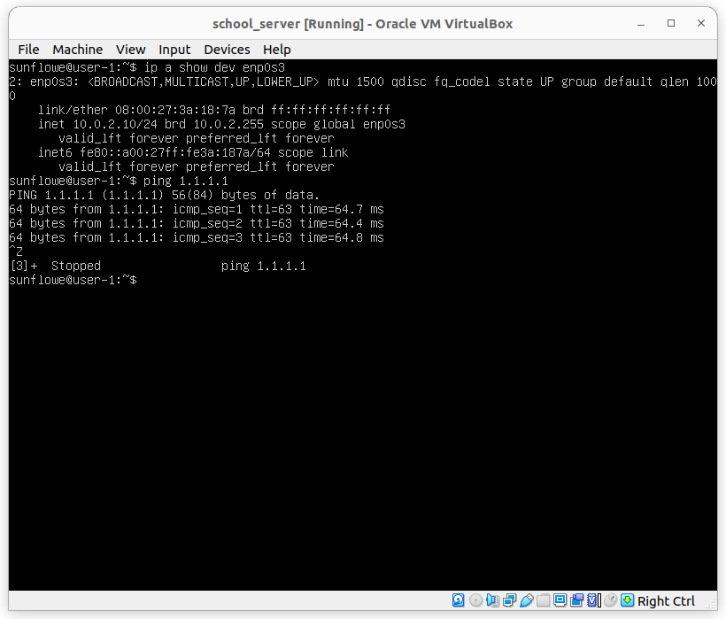
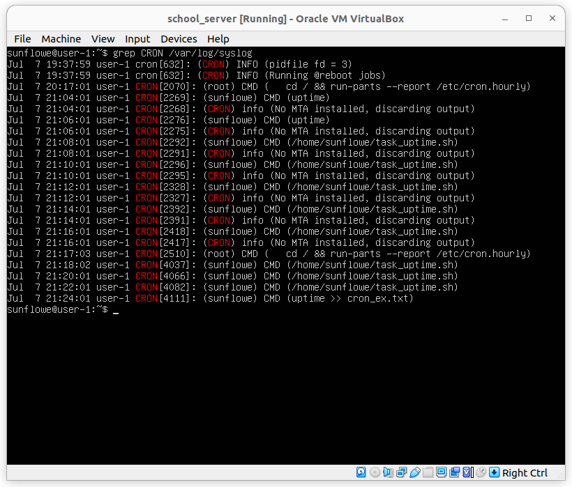

## PART_I

## PART_II

## PART_III

### TASK_I

1. Setup new name in '/etc/hostname' file
2. Change any occurrence of old name to new name in '/etc/hosts' file
3. Reboot and VOILA)))!

### TASK_II

1. Check your current timezone with command `timedatectl`
2. List all timezones with command `timedatectl list-timezones`
3. Set chosen timezone with command `timedatectl set-timezone [timezone name]`

### TASK_III

1. There are several commands for listing network interfaces such as `ip addr`, `ifconfig`, `ip link` and etc.
2. The loopback device is a special, virtual network interface that your computer uses to communicate with itself. It is used mainly for diagnostics and troubleshooting, and to connect to servers running on the local machine. (For more info go to [link](https://askubuntu.com/questions/247625/what-is-the-loopback-device-and-how-do-i-use-it))

### TASK_VI

1. The Dynamic Host Configuration Protocol (DHCP) is a network management protocol used on Internet Protocol (IP) networks for automatically assigning IP addresses and other communication parameters to devices connected to the network using a client–server architecture.

2. To get the address of machine we can use the commands like `ip addr`, `ip a`, `ifconfig` and etc.

### TASK_V

Command `curl https://ipinfo.io/ip; echo` will display external IP address.
Command `hostname -I` whill display internal IP address

### TASK_VI

Change the "*.yaml" file in the directory "/etc/netplan/" as above:

Then run command `sudo netplan apply`, then reboot the machine.
After reboot check the list op ip addresses with command `ip a show dev enp0s3`. Then check ping response by pinging to "1.1.1.1"

## PART_IV

Run the command `sudo apt upgrade` and then `sudo reboot`.

## PART_V

Sudo stands for SuperUser DO and is used to access restricted files and operations. By default, Linux restricts access to certain parts of the system preventing sensitive files from being compromised.
The sudo command temporarily elevates privileges allowing users to complete sensitive tasks without logging in as the root user.

## PART_VI

Command `timedatectl` outputs current time and set timezone

## PART_VII

* Vim can be installed with `sudo apt-get install vim` command.
* To create file just write command `vim filename` and press `Enter`. Then after writing file press `Esc` for switching from --Insert-- mode type `:x` to save and exit.

* Enter `vim filename` command to edit your file. After editing, if you don't want to save it just press `Esc`, type `:q!` and press `Enter` to close without changing the file

* To change the file open the file for edition with `vim` option. Press `Esc` to be sure that you are not in insert mode type `:%s /[old]/[new]/g` to replase 'old' to 'new' in every occurances.

## PART_VIII

* Usually in linux OS ssh is installed by default. If not, the command `sudo apt install openssh-server` will install ssh server to your computer
* Check activity of ssh by the command `sudo systemctl status sshd`. If it is not active, activate it by command `sudo systemctl start ssh.service`
* To reset port open /etc/ssh/sshd_config file with `sudo vim` option. Then add new line `Port 2022`, save and exit.
* To see the process run command `ps -C sshd` it will list sshd process id and tty "-C" key lists process which matches with given arguments after that key
* In `netstat`, `-a` key used for listing all ports, using TCP and UDP. `-t` key is used to output more userfriendly. If we use `-n`the IP addresses are shown as numeric values. The port numbers are also shown, separated by a colon ” : ” from the IP Address.

## PART_IX

* First line contains the program name (top), the current time, length of time since last boot, total number of users and the system load average over the last one, five and fifteen minutes.
* TASK and CPU States: This consists of a minimum of two lines. The first line shows the total tasks or threads (depends on the state of the Threads-mode toggle). This is then further classified into either running, sleeping, stopped or zombie (zombie processes are processes that have been terminated or are finished executing but have not been properly disposed). The second line shows CPU state percentages since the last refresh.
* Memory Usage: This consists of two lines which show the memory use in kibibytes(KiB). Recall that 1 KiB = 1024 bytes, and 1 MiB = 1024 KiB, and so on (in contrast to 1 KB = 1000 bytes, and 1 MB = 1000 KB). Line 1 shows physical memory while line 2 shows virtual memory (swap).
* To order processes by memory usage press `SHIFT + m` and processed are ordered in decreasing order. Alternatively `SHIFT + p` orders by CPU usage

* Press F6 and then choose sorting by option

## PART_X

* name -> `/dev/sda`
* capacity -> 12GB
* number of sectors -> 25161728
* swap size -> 1.9GB

## PART_XI

* To get info about `/` partition call command `df` and specify dir (for example `df /`). Sizes are shown in kbytes and ugly to read, `-h` key converts all sizes from kbytes to Gbytes. In addition if you want to get info about type of partition you can add `-T` key

## PART_XII

* To output about dirs we have to call command and pass all wanted dirs as arguments like `du /home /var /var/log`. If you want pick specific outputs you can combine `grep` command with it. In our case `sudo du /home /var /var/log | grep '/home$\|/var$\|/var/log$'` will filter output of `du` command

## PART_XIII

* One of the ways to output info about dir is running `ncdu` command from parent dir of wanted dir

## PART_XIV

* All logins is saved in "/var/log/auth.log" file. To search for logins filter this file output with `grep` tool (`cat /var/log/auth.log | grep -i systemd`)

## Part_XV

